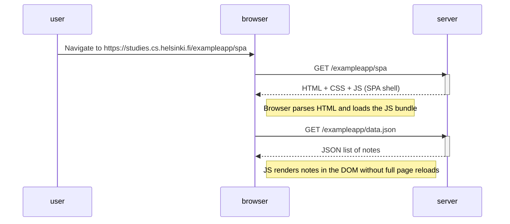

```mermaid
sequenceDiagram
    participant user
    participant browser
    participant server

    user->>browser: Navigate to https://studies.cs.helsinki.fi/exampleapp/spa
    browser->>server: GET /exampleapp/spa
    activate server
    server-->>browser: HTML + CSS + JS (SPA shell)
    deactivate server

    Note right of browser: Browser parses HTML and loads the JS bundle

    browser->>server: GET /exampleapp/data.json
    activate server
    server-->>browser: JSON list of notes
    deactivate server

    Note right of browser: JS renders notes in the DOM without full page reloads
```