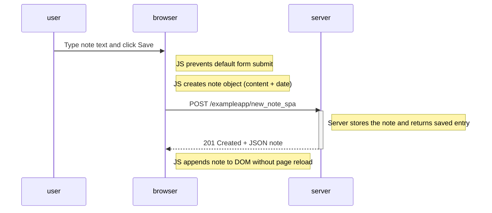

```mermaid
sequenceDiagram
    participant user
    participant browser
    participant server

    user->>browser: Type note text and click Save
    Note right of browser: JS prevents default form submit
    Note right of browser: JS creates note object (content + date)

    browser->>server: POST /exampleapp/new_note_spa
    activate server
    Note right of server: Server stores the note and returns saved entry
    server-->>browser: 201 Created + JSON note
    deactivate server

    Note right of browser: JS appends note to DOM without page reload
```